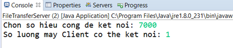
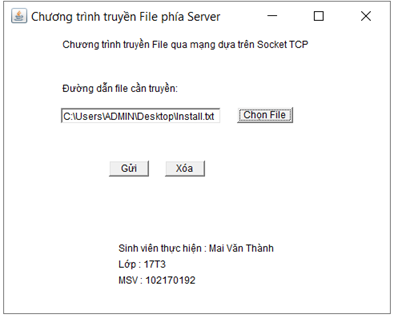
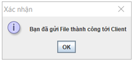
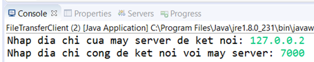
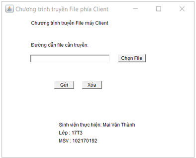
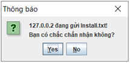
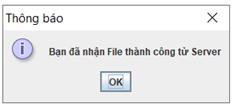

## Mai Văn Thành

## Yêu cầu của project
### Xây dựng ứng dụng truyền file qua mạng. Sử dụng lập trình Socket trong Java

## Server
### Khởi động Server

### Giao diện phía Server

### Thông báo gửi file thành công

## Client
### Khởi động Client

### Giao diện phía Client

### Xác nhận có nhận file hay không

### Thông báo nhận file thành công
